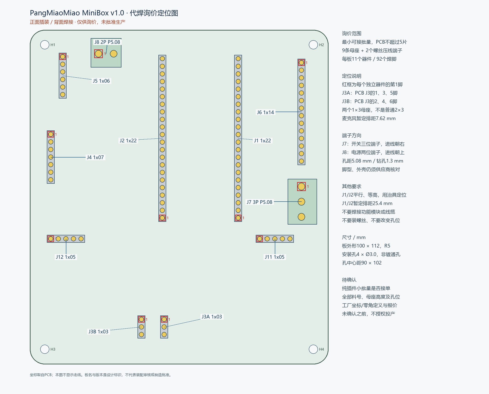

# PangMiaoMiao MiniBox v1.0 代焊询价资料

**历史资料：以下全部 v1.0 坐标、BOM、尺寸、报价和 ZIP 已不适用于
2026-10-09 直焊四键/摇杆 v1.1 载板，禁止按旧包投产。**
当前资料在 `revision-20261009`，以其 DRC/manifest 和
[`载板 HTML`](../carrier-revision.html)为准。保留本文仅用于追溯旧询价。

**仅供询价和工艺审核，未批准生产，也未选定最终器件。**
用户要求最小可接批量，**PCB数量不超过5片**。不要按10片或更大批量下单。
PCB与纯插件代焊的最小量可能不同，须由嘉立创明确确认，不能把“2片起贴”
自动理解成这张纯插件板已可按2片生产。

## 可发送给嘉立创的询价正文

您好，请确认下面这块纯插件载板能否做小批量代焊，并提供最小可接数量及报价。

- 项目：PangMiaoMiao MiniBox，v1.0，设计日期2026-10-03。
- 四层FR-4，100 × 112 mm，板厚1.6 mm，R5圆角，绿油白字。
  2026-10-08改为顶层信号／内层GND／内层电源／底层信号；
  电源层分为3V3、5V_IN和5V_SW，请按四层重新报价并确认工厂叠层。
  表面处理倾向无铅喷锡，请核实与插件焊接工艺兼容并报价。
- 请按允许的最小PCB及代焊数量报价，**不超过5片**。
  如果PCB必须做5片而代焊可只做更少片，请分别列出板数、焊接板数、
  其余裸板的交付及各项费用，不直接替客户决定。
- 没有SMD元件，仅9条2.54 mm直插母座及2个5.08 mm螺丝压线端子，
  每板11个独立器件、92个焊脚。功能模块和线缆不装配。
- 所有连接器从正面插装、背面焊接。请确认是否可承接纯DIP小批量，
  是手工焊、选择性焊还是波峰焊，以及最低加工费、物料费、
  寄料费、治具费、损耗备料要求、税费、交期和运费。
- 电源J8为两位螺丝压线端子，开关J7为三位螺丝压线端子。
  均为5.08 mm针距、1.3 mm镀通孔，焊盘直径2.6 mm。
  请确认这两种端子也可以代焊；不能只按针距认定任意端子兼容。
- 当前端子封装对应Phoenix MKDS 1,5系列：J8两位、J7三位；
  J8进线朝板上边，J7进线朝右边，螺丝从正面操作。
  请提供拟用料号和尺寸图，核对脚型、外壳和进线空间。
- ESP32的J1/J2各为1×22母座，暂定排距25.4 mm，必须平行、等高；
  请采用定位治具，确认是否需要额外治具费用。
- 麦克风使用**两个独立1×3母座**，暂定排距7.62 mm。
  装配资料中称为J3A、J3B；PCB中仍为一个J3封装。
  不可装成普通2×3母座。具体对应见定位图和逐孔表。
- 请审核BOM、坐标和定位图，给出可装配的确切料号及厂家零角定义。
  当前料号尚未选定，坐标是询价参考，**不可直接投产**。
- 最终100 × 112 mm、R5外形、4个Ø3.0 mm非镀安装孔、
  90 × 102 mm孔中心距、全部孔位及天线禁铜区必须保留。
  如果需要工艺边/MARK或对圆角有额外要求，请先提供加工方案；
  不授权擅自修改最终外形或孔位。
- 请先回复能否接单、所需补充资料、最小数量和报价。
  **这只是询价，不授权投产、扣款、采购或未经同意替换物料。**

## 每板物料范围

| 位号 | 器件 | 每板数量 | 焊脚数 |
|---|---|---:|---:|
| J1、J2 | 2.54 mm 1×22直插母座 | 2 | 44 |
| J3A、J3B | 2.54 mm 1×3直插母座 | 2 | 6 |
| J4 | 2.54 mm 1×7直插母座 | 1 | 7 |
| J5 | 2.54 mm 1×6直插母座 | 1 | 6 |
| J6 | 2.54 mm 1×14直插母座 | 1 | 14 |
| J11、J12 | 2.54 mm 1×5直插母座 | 2 | 10 |
| J7 | 5.08 mm三位螺丝压线端子 | 1 | 3 |
| J8 | 5.08 mm两位螺丝压线端子 | 1 | 2 |
| 合计 | 9条母座及2个端子 | 11 | 92 |

不包含ESP32、麦克风、功放、RTC、LCD、键盘、摇杆、外接开关模块、
电源线、螺丝或外壳。母座板上孔径1.0 mm、焊盘直径1.7 mm；
母座高度、插接长度和实际模块排距仍需确认。
五片全部代焊的上限用量为45条母座、10个端子、460个焊脚，
不含厂商要求的损耗备料，不代表已选择五片下单。

## 文件和坐标约定

| 文件 | 用途 |
|---|---|
| `bom-quote.csv` | 八种物料的询价BOM，含Comment / Designator / Footprint；最终料号留空并标为NOT_SELECTED |
| `positions-quote.csv` | 十一个独立器件的正面装配参考坐标，mm |
| `pin-map-quote.csv` | 92个实际孔的位号、物理针序、原PCB焊盘号、网络、坐标和孔径 |
| `assembly-front-quote.png` | 正面插装定位图，红框表示每个独立器件的第1脚 |
| `quote-manifest.json` | PCB/Gerber的SHA-256、来源提交、逐器件数据和未决事项 |
| `minibox-assembly-quote.zip` | 上述资料、本文及当前Gerber ZIP的询价合集 |

合集内嵌了独立Gerber ZIP供客服核对，**不能把询价合集当成PCB Gerber文件上传**。
正式PCB上传文件仍是
[`../fabrication/minibox-carrier-jlcpcb.zip`](../fabrication/minibox-carrier-jlcpcb.zip)。

CSV为UTF-8 BOM编码。`positions-quote.csv`的`Layer`为Top，表示正面器件，
不是焊接面。原点为板框左下角，在KiCad坐标中为 **(5,115) mm**；
X向右，Y向上，正面观察，不镜像：

- `Mid X = KiCad X - 5`，`Mid Y = 115 - KiCad Y`。
- Mid坐标取每个独立器件的**通孔中心平均值**，不是第1脚或保证等于外壳中心。
- Rotation使用KiCad封装角度，逆时针为正并换算到0–360°；
  不是已校准的嘉立创器件库零角。须结合逐孔表及定位图复核。
- J3A对应PCB J3的1、3、5号焊盘，J3B对应2、4、6号焊盘；
  两个母座的物理针序都从上到下1、2、3。
- J1/J2第1脚在下端，J11/J12第1脚在左端，
  J7第1脚在上端，J8第1脚在左端。

四层版本保留全部连接器孔位、针序、钻孔和正面丝印；
原装配定位图及坐标继续用于连接器定位，不用于审核内层铜皮。
本合集的Gerber、层数和文件哈希已按四层版本更新。
PCB、Gerber或器件型号改变后须重新生成并审核这些资料；
不能仅修改BOM文字后继续沿用旧坐标或旧合集。

## 已核实的候选和仍待确认的事项

- ESP32母座候选：[兆星 ZX-PM2.54-1-22PY，C7499337](https://item.szlcsc.com/8573998.html)。
  官方商城明确为1×22、2.54 mm直插排母；
  **商城货源不等于嘉立创装配库存，也未完成高度、针脚和插接匹配审核**。
- J8封装参考：[Phoenix MKDS 1,5/2-5,08，1715721](https://www.phoenixcontact.com/en-us/products/printed-circuit-board-terminal-mkds-15-2-508-1715721)。
- J7封装参考：[Phoenix MKDS 1,5/3-5,08，1715734](https://www.phoenixcontact.com/en-us/products/printed-circuit-board-terminal-mkds-15-3-508-1715734)。
  原厂页面明确两/三位、5.08 mm、螺丝连接及波峰焊安装。
  页面中的3.5 mm是**焊脚长度**，不是脚径；脚截面、钻孔及外壳仍须按尺寸图审核。
  这些是封装参考型号，并非已选择采购的料号；替代品也须审核，不自动认可等效。
- [嘉立创工艺能力表](https://www.jlc-smt.com/vtechnology)明确有插件焊接；
  其中标准型“2片起贴”并不能单独证明本板纯DIP最小量。
- 可参考[邮寄料流程](https://www.jlc.com/portal/server_guide_20260.html)；
  如果不能用工厂库存，须确认寄料、损耗数量和费用后再采购或寄出。
- 微型纯DIP批量是否接单、全部确切料号、母座高度、实物排距、
  J7/J8机械兼容性、加工参数、报价及订单数量均未确认。
- **已向嘉立创SMT网站的“嘉小智”客服发送本询价范围的文字。**
  机器人仅返回人工业务员联系方式，未确认接单、报价或转交人工。
  未找到聊天附件上传入口，询价ZIP尚未发送；不能把这次聊天当成正式代焊申请。
- **以下网站询价记录来自改版前的双层板，不适用于当前四层板，
  尚未重新上传四层Gerber或向客服发送四层改版资料。**
  当时PCB网页最小可选批量为5片；100 × 112 mm、两层、1.6 mm、
  绿油白字、无铅喷锡的裸板预估为102.48元：
  工程费30元、板费30.80元、喷镀费31.68元、默认附加赔付费10元。
  网页快递费尚未显示，**不认定为含运费报价，也不包含代焊或连接器物料**。
- 已选择手动确认订单。取消10元附加服务需要确认常规赔付条款；
  常规方案仅赔PCB，不赔PCBA元器件。条款尚未确认，订单尚未提交。
  另加3元生产稿确认后的95.48元只是计算预估，尚非网页最终报价。
- SMT下单页目前只有演示订单，没有可关联的MiniBox订单；
  PCB下单页的SMT说明允许自动修改工艺边/MARK及圆角，
  与本板保留R5最终外形的要求尚未协调，须人工审核。
- **尚未提交正式PCB或代焊订单，尚未付款，也未批准生产。**
